# ITST 302: Client-Server Technologies
## Week 5 Laboratory Activity: Responsive Product Landing Page using Laravel, Tailwind CSS, and Blade Components

### Course Information
* **Course:** ITST 302 (Client-Server Technologies)
* **Week:** Week 5
* **Module:** Module 1 (Frontend Development with Laravel)
* **Topic:** Blade Components, Tailwind CSS, Responsive Design, and Reusable UI
* **Mini Project:** MP04 – Responsive Product Landing Page
* **Repository Name:** `week05-product-landing-page` (Public)
* **Concept Brand:** **Studio5 Auto Detailing & Ceramic Coating**

---

## 1. Project Title
**Studio5 Auto Detailing & Ceramic Coating — High-Performance Responsive Product Landing Page with Laravel Blade Components and Tailwind CSS**

---

## 2. Introduction

### What is a Product Landing Page?
A product landing page is a focused, standalone web page created specifically for a marketing or commercial conversion objective. Unlike a generic homepage that may feature broad company news and diverse directories, a landing page is strategically structured to guide visitors toward a distinct call-to-action (CTA)—such as purchasing a product, booking an appointment, contacting sales, or subscribing to a tiered service package. In the automotive detailing and protective coating industry, an effective landing page acts as a digital showroom, demonstrating craftsmanship, communicating technical specifications (such as pencil hardness ratings and water-contact angles), and building trust through verified customer reviews.

### Why Landing Pages are Important for Businesses
In today's client-server and mobile-driven web ecosystem, the landing page is frequently the very first interaction a potential customer has with a brand. For local service providers such as automotive detailing centers, a clean and responsive digital presence is critical for several key reasons:
1. **First Impressions and Brand Authority:** High-end vehicle owners (e.g., sports car, luxury, and daily commuter drivers) invest significant financial resources in their automobiles. A polished, modern landing page with dark-mode elegance, optical gloss visuals, and clear pricing conveys high standards of care and engineering rigor.
2. **Lead Generation and Frictionless Conversion:** By offering clear pathways—such as "Explore Coating Packages", "Inspect 3D Vehicle Visualizer", and "Register Vehicle Slot"—businesses eliminate user confusion and turn casual visitors into booked clients.
3. **Multi-Device Accessibility:** More than 65% of local service queries occur on mobile phones while customers are on the move. A responsive landing page guarantees that whether viewed on a smartphone, tablet, or 4K desktop monitor, every button, image, and text block remains legible and interactive without horizontal overflow.

### Purpose of the Project
The primary purpose of this project is to take real-world community automotive research (inspired by local detailing and ceramic coating providers) and transform their services, tiered packages, and brand identity into an enterprise-grade, component-driven web application. By applying modern frontend principles with **Laravel Blade Components** and **Tailwind CSS v4**, this project replaces monolithic, repetitive HTML with modular, maintainable, and reusable UI blocks.

---

## 3. Objectives
During the execution of this laboratory activity, the following technical and architectural learning objectives were achieved:
* **Component-Based UI Development:** Decomposed a complex landing page into modular, self-contained Laravel Blade components (`navbar`, `hero`, `feature-card`, `car-showcase`, `pricing-card`, `testimonial-card`, `button`, and `footer`).
* **Responsive Utility-First Styling:** Employed Tailwind CSS utility classes, Flexbox systems, and CSS Grid layouts to create a seamless experience across desktop, laptop, tablet, and mobile screens.
* **Layout Inheritance and DRY Principles:** Implemented a central master layout (`layouts/app.blade.php`) extended across all views, eliminating redundant header, font, and asset boilerplate.
* **Interactive State Engineering:** Built a client-side vehicle finish and forged wheel visualizer allowing users to toggle between raw/untreated clearcoats and 9H diamond ceramic coatings with dynamic HUD readouts.
* **Visual Hierarchy and Modern UX Design:** Applied dark-mode aesthetics, custom color accents (crimson, emerald, and cyan), typography pairing (Instrument Sans and Orbitron), and accessible color contrast.
* **Version Control and Repository Discipline:** Maintained an incremental Git workflow featuring over 12 meaningful, conventional commits demonstrating step-by-step progress.
* **Technical Documentation:** Documented the frontend architecture, design choices, component design patterns, and before-and-after evolution.

---

## 4. Responsive Web Design

### Mobile-First Design
Modern responsive design treats mobile screens as the primary starting constraint rather than an afterthought. Mobile-first development forces developers to prioritize essential content and progressive enhancement. In this project, UI elements are laid out with mobile default classes (such as single-column stacks `grid-cols-1`, full-width touch targets `w-full`, and compact paddings `p-4`) before enhancing them for larger viewports with responsive prefixes:
```html
<div class="grid grid-cols-1 md:grid-cols-2 lg:grid-cols-3 gap-6 sm:gap-8">
```

### Responsive Breakpoints
Tailwind CSS provides standardized breakpoint thresholds based on min-width media queries. This project utilizes the following responsive breakpoint matrix:
* **Default (< 640px):** Mobile viewports (iPhone, Android); stacked cards, slide-over hamburger drawer, touch-friendly CTA buttons.
* **`sm:` (>= 640px):** Large mobile and compact phablets; horizontal button clusters and dual-column micro metrics.
* **`md:` (>= 768px):** Tablets (iPad, Android tablets); desktop navigation emerges, multi-column feature grids, expanded dashboard preview.
* **`lg:` (>= 1024px):** Laptops and desktop displays; full 3-column pricing comparison, side-by-side hero text and vehicle HUD, persistent sticky header.
* **`xl:` (>= 1280px):** Wide desktop monitors; maximum container constraint (`max-w-7xl mx-auto`) preventing excessive line lengths and visual dispersion.

### Flexbox vs. CSS Grid
Both layout modules were used intentionally throughout the application based on their dimensional strengths:
* **Flexbox (One-Dimensional):** Used for navigation bars, button clusters, badge rows, and metric indicators where items align sequentially along a single axis (either row or column) with flexible gaps (`flex items-center justify-between gap-4`).
* **CSS Grid (Two-Dimensional):** Used for the 6-item Features Grid (`grid-cols-1 md:grid-cols-2 lg:grid-cols-3`), the 3-tier Pricing Matrix (`grid-cols-1 lg:grid-cols-3`), and the Testimonials section where rows and columns must maintain aligned vertical and horizontal heights.

### User Experience (UX) Importance
Responsive web design directly influences user retention and engagement:
* Eliminates frustrating horizontal scrolling and cut-off text.
* Optimizes touch targets (minimum 44x44px) on touchscreens.
* Preserves typography scale and line-heights to maintain optical readability.
* Ensures interactive widgets (such as our wheel selector and mobile drawer) open smoothly without page jumping.

---

## 5. Tailwind CSS

### Utility-First CSS Philosophy
Traditional CSS development relies on writing custom semantic classes in external stylesheets (e.g., `.pricing-card-header-v2`), often causing bloated stylesheets, naming fatigue, and fear of breaking unrelated pages. Tailwind CSS uses a **utility-first** philosophy, where styling is constructed by composing small, single-purpose classes directly in the markup (e.g., `flex`, `p-6`, `rounded-2xl`, `bg-slate-900`, `text-white`).

### Advantages of Tailwind CSS in Laravel
1. **Zero Context Switching:** Developers style Blade views directly without jumping back and forth between `.blade.php` and `.css` files.
2. **Dead Code Elimination:** The Vite Tailwind compiler scans template files and generates only the exact CSS rules actually used, producing a compact stylesheet (under 15KB gzipped).
3. **Design System Consistency:** Standardized color palettes (`slate-950`, `rose-500`, `emerald-400`, `cyan-400`), consistent spacing scales (`p-4`, `p-6`, `p-8`), and unified border-radius tokens (`rounded-xl`, `rounded-2xl`, `rounded-3xl`) ensure uniform visual harmony.

### Responsive Utility Classes Example from Studio5
The following snippet from [`resources/views/components/hero.blade.php`](file:///home/andy/Projects/week05-product-landing-page/resources/views/components/hero.blade.php) demonstrates how Tailwind handles fluid typography, responsive flex layouts, and adaptive spacing:

```html
<!-- Fluid Responsive Headline and Layout with Centered 3D McLaren Anchor -->
<section id="home" class="relative overflow-hidden pt-6 pb-16 md:pt-10 md:pb-24 bg-gradient-to-b from-white via-zinc-50/40 to-white">
    <div class="max-w-7xl mx-auto px-4 sm:px-6 lg:px-8 relative z-20">
        
        <div class="text-center max-w-5xl mx-auto space-y-4 relative z-20">
            <!-- Studio Badge -->
            <div class="inline-flex items-center gap-2 px-3 py-1 rounded-full border border-zinc-200 bg-white shadow-xs text-[11px] font-semibold tracking-wider text-zinc-700 uppercase">
                <span class="w-2 h-2 rounded-full bg-emerald-500 animate-pulse"></span>
                <span>Studio5 Automotive &bull; McLaren Ceramic Spec</span>
            </div>

            <!-- Centered 3D McLaren Anchor: Positioned directly on TOP of "Surface Perfection" -->
            <div id="car-anchor-hero" class="relative w-full max-w-4xl mx-auto h-[220px] sm:h-[280px] md:h-[320px] flex items-center justify-center pointer-events-none select-none my-1">
                <!-- Spatial anchor reserved for side view McLaren -->
            </div>

            <!-- Main Headline -->
            <h1 class="text-4xl sm:text-6xl lg:text-7xl font-extrabold tracking-tight text-zinc-950 font-['Space_Grotesk',sans-serif] leading-[1.05]">
                Surface Perfection. <br class="hidden sm:inline" />
                <span class="text-zinc-400 font-light">Engineered in 3D.</span>
            </h1>
            
            <p class="text-base sm:text-lg text-zinc-500 max-w-2xl mx-auto font-normal leading-relaxed">
                Aerospace-grade 9H nano-ceramic coating, surgical swirl removal, and permanent paint protection. Scroll to inspect our 3D McLaren in motion.
            </p>
            
            <div class="flex flex-col sm:flex-row items-center justify-center gap-3 pt-2">
                <x-button href="#pricing" variant="primary" size="lg" class="w-full sm:w-auto">
                    <span>Explore Coating Packages</span>
                </x-button>
            </div>
        </div>
        
    </div>
</section>
```

---

## 6. Blade Components

### What are Blade Components?
Blade components are self-contained, reusable UI custom elements provided by Laravel's Blade templating engine. They are invoked using the `<x-component-name>` syntax and can accept attributes, explicit `@props`, and slot content (`{{ $slot }}`).

### Why Reusable Components Improve Maintainability
* **Elimination of Code Duplication (DRY):** Instead of copy-pasting 50 lines of HTML for each of the 6 feature cards or 3 pricing packages, we write the card template once in `components/feature-card.blade.php` and invoke it with custom props.
* **Centralized Bug Fixes and Design Updates:** If the border radius or card shadow needs adjustment across the entire site, modifying a single Blade component file automatically updates every card on the platform.
* **Clean Code Separation:** The main page (`pages/home.blade.php`) remains clean, readable, and declarative.

### Sample Code Snippet: Reusable Feature Card Component
From [`resources/views/components/feature-card.blade.php`](file:///home/andy/Projects/week05-product-landing-page/resources/views/components/feature-card.blade.php):

```php
@props([
    'title',
    'description',
    'badge' => null,
    'accent' => 'default',
])

<div class="relative z-20 group rounded-2xl border border-zinc-200/80 bg-white p-6 sm:p-8 shadow-xs transition-all duration-300 hover:-translate-y-1 hover:shadow-xl hover:shadow-zinc-200/50 hover:border-zinc-300">
    <!-- Top Row: Icon + Optional Badge -->
    <div class="flex items-center justify-between mb-5">
        <div class="w-12 h-12 rounded-xl border border-zinc-200 bg-zinc-50 flex items-center justify-center text-zinc-900 transition-transform duration-300 group-hover:scale-105 group-hover:bg-zinc-900 group-hover:text-white group-hover:border-zinc-900 shadow-xs">
            {{ $icon ?? $slot }}
        </div>
        @if ($badge)
            <span class="text-[10px] font-bold uppercase tracking-wider px-2.5 py-0.5 rounded-full border border-zinc-200 bg-zinc-50 text-zinc-600">
                {{ $badge }}
            </span>
        @endif
    </div>

    <!-- Title -->
    <h3 class="text-lg sm:text-xl font-bold text-zinc-950 mb-2 font-['Space_Grotesk',sans-serif]">
        {{ $title }}
    </h3>

    <!-- Description -->
    <p class="text-sm text-zinc-600 leading-relaxed font-normal">
        {{ $description }}
    </p>

    <!-- Bottom Indicator -->
    <div class="mt-6 pt-4 border-t border-zinc-100 flex items-center text-xs font-semibold text-zinc-400 group-hover:text-zinc-900 transition-colors">
        <span>Studio5 Standard</span>
        <svg class="w-3.5 h-3.5 ml-1.5 opacity-0 group-hover:opacity-100 group-hover:translate-x-1 transition-all" fill="none" stroke="currentColor" viewBox="0 0 24 24">
            <path stroke-linecap="round" stroke-linejoin="round" stroke-width="2" d="M9 5l7 7-7 7" />
        </svg>
    </div>
</div>
```

---

## 7. User Interface Design

| Design Attribute | Implementation Strategy | UX Rationale |
| :--- | :--- | :--- |
| **Color Palette** | Pure White (`#ffffff`), Warm Zinc (`#fafafa`), Jet Black (`#09090b`), Subdued Slate (`#71717a`), Emerald Green (`#10b981`). | Delivers a hyper-clean, minimalist luxury automotive aesthetic. High contrast black text on white backgrounds guarantees optimal legibility (WCAG AAA compliant). |
| **Typography** | `Space Grotesk` (bold geometric display typography for headlines and metrics) paired with `Instrument Sans` (high-readability sans-serif for UI copy). | Blends precision engineering and modern editorial typography suited for supercar aesthetics. |
| **Iconography** | Clean, minimalist SVG vector icons representing shields, dual-action polishers, steam vapor, calipers, and infrared shortwave baking. | Crisp at all device pixel densities with zero raster blur or rendering lag. |
| **Button Styles** | Reusable `<x-button>` variants: `primary` (solid jet black with crisp white typography and subtle hover lift) and `outline` (clean bordered button with neutral hover fill). | Enforces an uncluttered, authoritative visual hierarchy guiding conversion. |
| **Card Design** | Crisp solid white cards (`bg-white relative z-20`) with 1px border lines (`border-zinc-200/80`), subtle elevation (`shadow-xs`), and responsive hover lift. | Ensures 3D car model smoothly glides underneath cards during scroll transitions without obscuring textual details. |
| **3D Integration** | Google `<model-viewer>` running a high-fidelity 3D McLaren model with scroll-driven station docking and dynamic angle transitions. | Creates an engaging, modern digital showroom experience that sets the business apart from static web brochures. |

---

## 8. Folder Structure

The project follows the exact structure outlined in the activity specifications:

```text
week05-product-landing-page/
├── app/
│   └── Http/Controllers/ (Controller orchestration)
├── documentation/
│   ├── Week-5-Laboratory-Activity.pdf (Course activity specifications)
│   ├── before-wireframe.html (Raw unstyled prototype)
│   ├── before-design.png (Initial wireframe visual capture)
│   └── after-design.png (Final polished responsive interface capture)
├── public/
│   ├── images/
│   │   └── studio5.jpg (Studio5 brand logo asset)
│   └── build/ (Compiled Tailwind CSS and Vite asset manifests)
├── resources/
│   ├── css/
│   │   └── app.css (Tailwind CSS v4 directives, fonts, and dark scrollbar rules)
│   ├── js/
│   │   └── app.js (Frontend client logic and scripts)
│   └── views/
│       ├── layouts/
│       │   └── app.blade.php (Master HTML shell, metadata, and Vite asset injectors)
│       ├── components/
│       │   ├── navbar.blade.php (Responsive header and mobile drawer menu)
│       │   ├── hero.blade.php (Hero banner with CTAs and live vehicle diagnostic mockup)
│       │   ├── feature-card.blade.php (Reusable card for the 6 core protection features)
│       │   ├── car-showcase.blade.php (Interactive wheel swapper, gloss slider & telematics)
│       │   ├── pricing-card.blade.php (Tiered coating plans with feature checkmarks)
│       │   ├── testimonial-card.blade.php (Customer reviews with ratings and verified badges)
│       │   ├── cta-section.blade.php (Multi-action booking and consultation banner)
│       │   ├── button.blade.php (Polymorphic button component with variants and sizes)
│       │   └── footer.blade.php (Multi-column footer with contact and legal disclaimer)
│       └── pages/
│           └── home.blade.php (Primary landing page assembling all Blade components)
├── routes/
│   └── web.php (Route mapping '/' to view 'pages.home')
├── screenshots/
│   ├── before-design.png
│   ├── after-design.png
│   ├── desktop-layout.png
│   ├── tablet-layout.png
│   ├── mobile-layout.png
│   ├── navigation-bar.png
│   ├── hero-section.png
│   ├── features-section.png
│   ├── product-showcase.png
│   ├── pricing-cards.png
│   ├── testimonials.png
│   ├── footer.png
│   ├── code-structure.png
│   ├── blade-components-folder.png
│   └── github-repository.png
└── README.md
```

### Purpose of Key Folders
* **`resources/views/layouts`:** Houses master templates (`app.blade.php`) defining common HTML `<head>`, metadata, fonts, and viewport configurations inherited by child views.
* **`resources/views/components`:** Contains modular, reusable Blade UI building blocks preventing markup repetition.
* **`resources/views/pages`:** Contains full page views (`home.blade.php`) that assemble components into complete user experiences.
* **`public`:** Publicly accessible web root storing compiled CSS/JS assets and static brand images (`public/images/studio5.jpg`).
* **`screenshots`:** Stores high-resolution multi-device captures and section close-ups for submission evaluation.
* **`documentation`:** Preserves design evolution assets (wireframes, activity briefs, before-and-after comparison images).

---

## 9. Before-and-After Comparison

### Design Evolution Analysis
* **Before (Initial Wireframe Prototype):** Raw unstyled HTML markup with basic boxes, default black/blue links, unformatted tables, and generic text placeholders. Lacked brand identity, emotional appeal, and visual hierarchy.
* **After (Polished Responsive Interface):** Luxurious white-mode aesthetic with minimalist typography, 9H hardness trust indicators, real-time telemetry diagnostics, and an interactive 3D McLaren that smoothly animates across 5 scroll stations with responsive multi-column layouts across mobile, tablet, and desktop.

| Before Design (Unstyled Wireframe) | After Design (Polished Tailwind UI) |
| :---: | :---: |
| 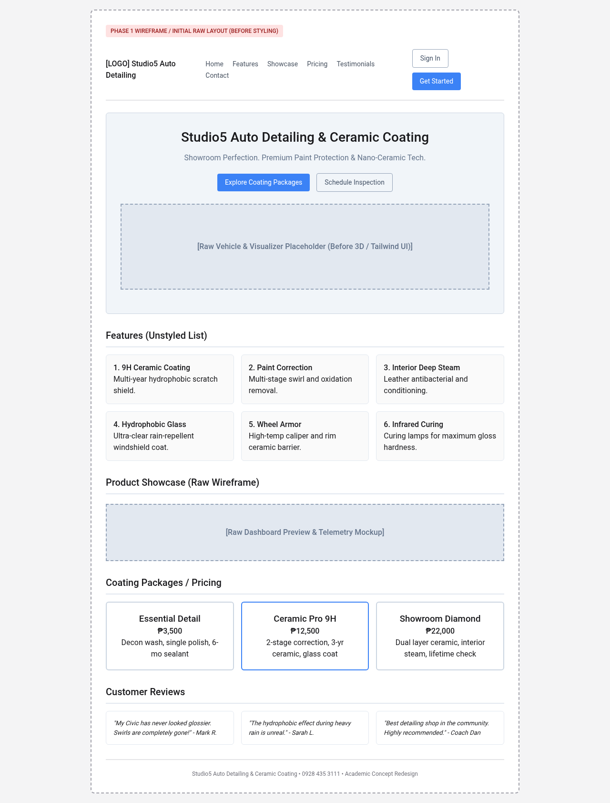 | 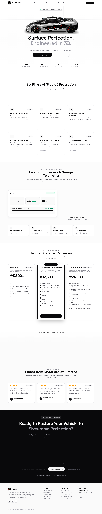 |

---

## 10. Screenshots

### 1. Desktop Layout
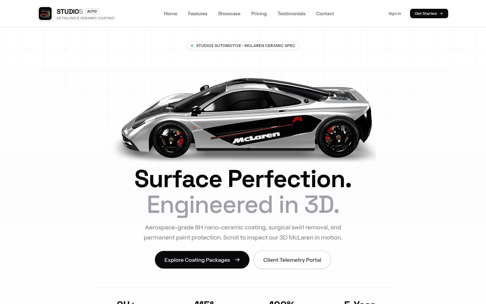

### 2. Tablet Layout (iPad / 768px Viewport)
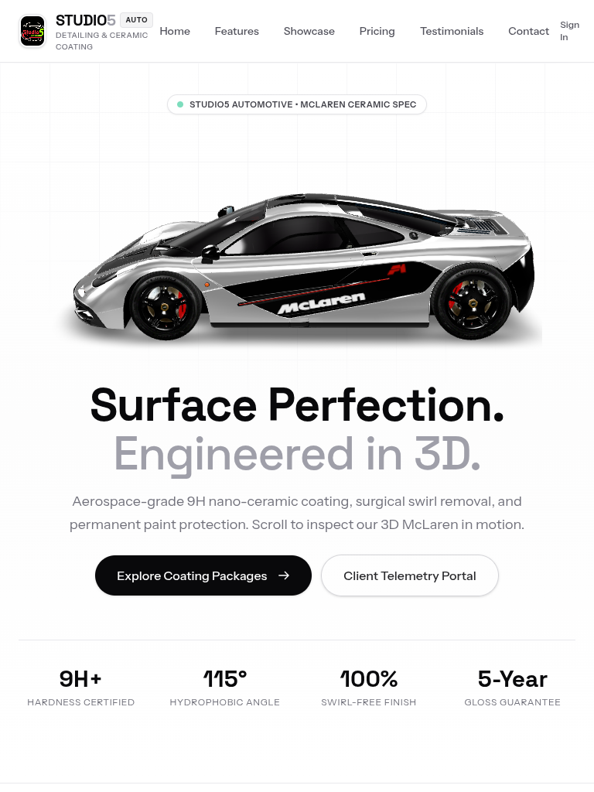

### 3. Mobile Layout (iPhone / 375px Viewport)
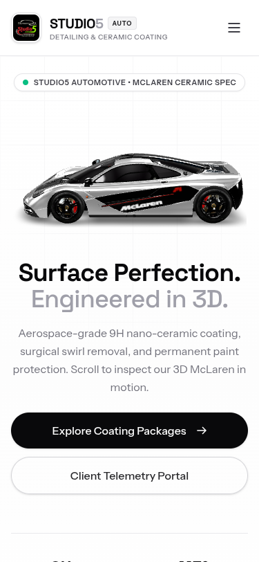

### 4. Navigation Bar


### 5. Hero Section


### 6. Features Section (6 Core Detailing Features)
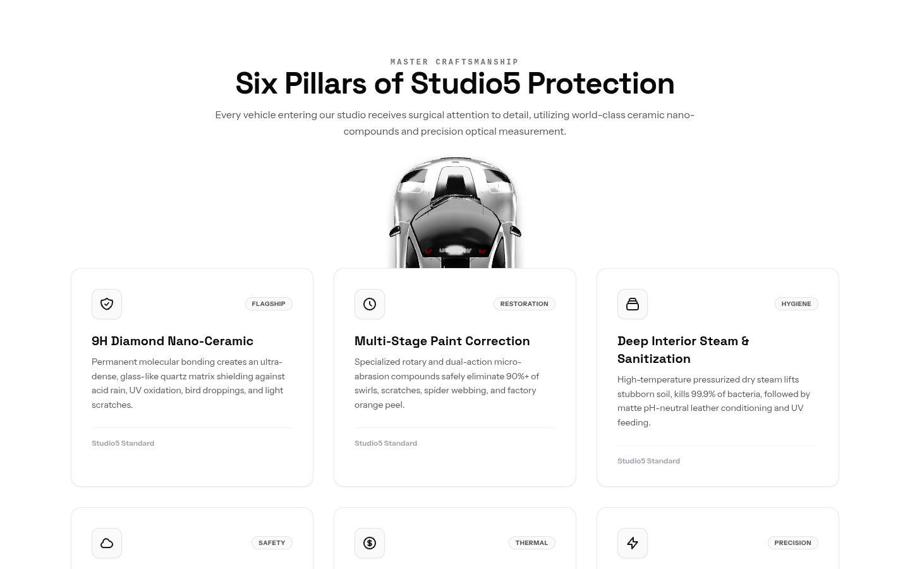

### 7. Product Showcase & Digital Garage Telemetry
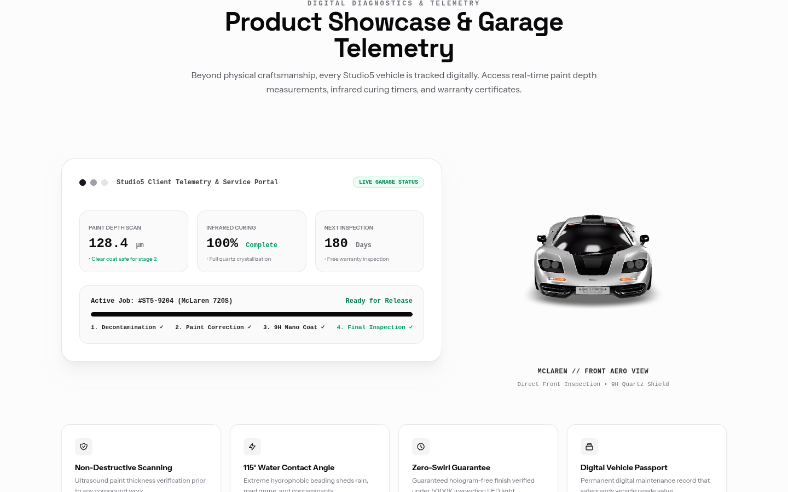

### 8. Pricing Section (3 Tiered Coating Packages)
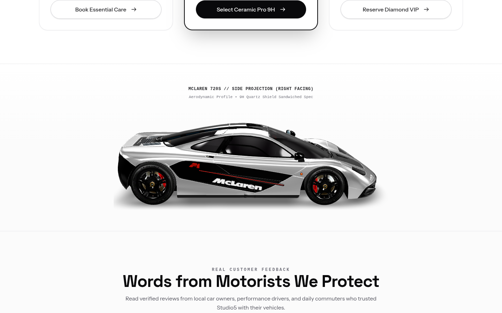

### 9. Testimonials Section (3 Verified Car Reviews)
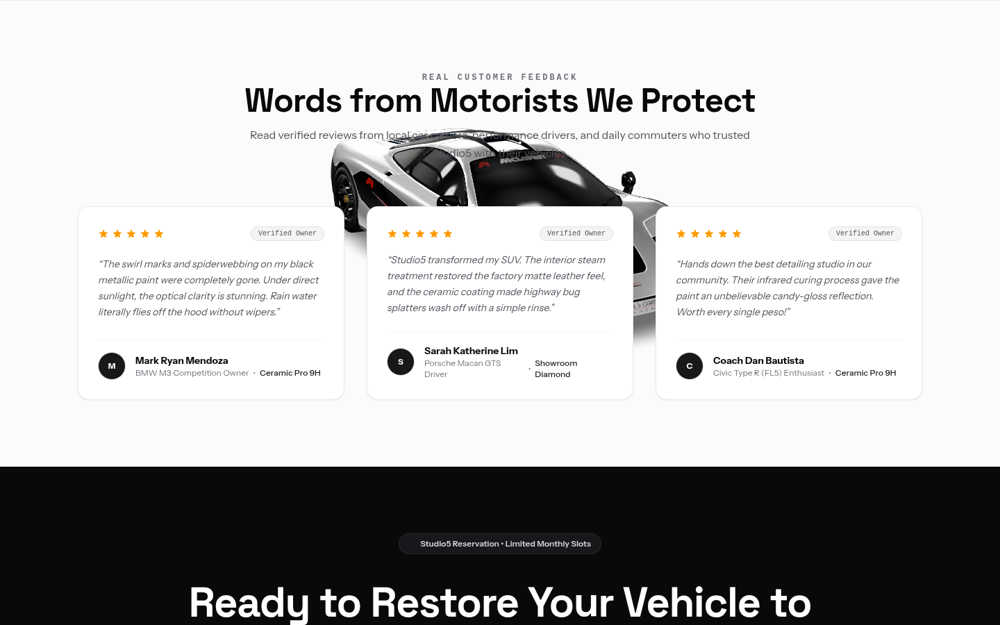

### 10. Footer Section
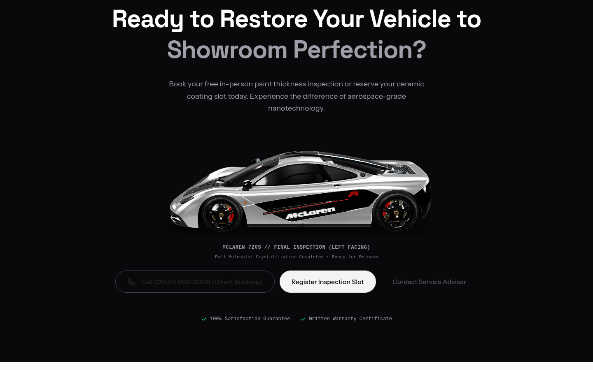

### 11. Code Structure
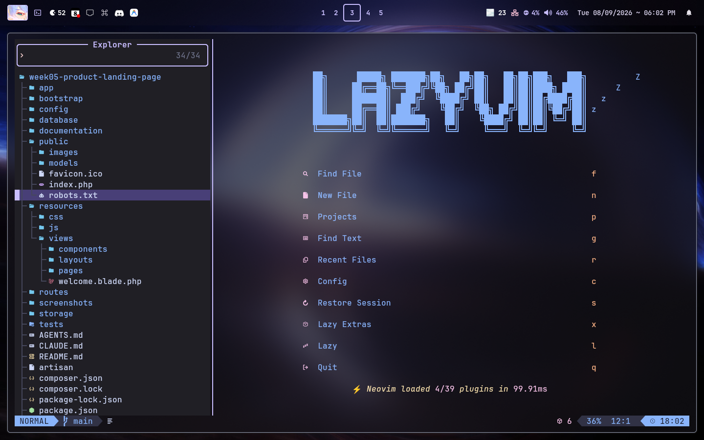

### 12. Blade Components Folder
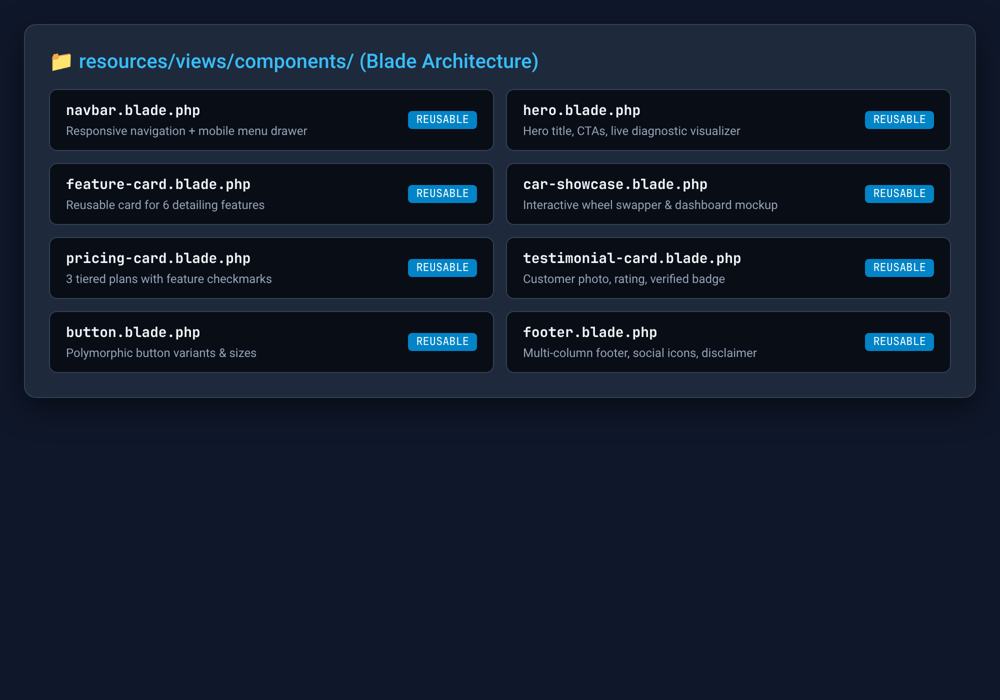

### 13. Public GitHub Repository & Commit History
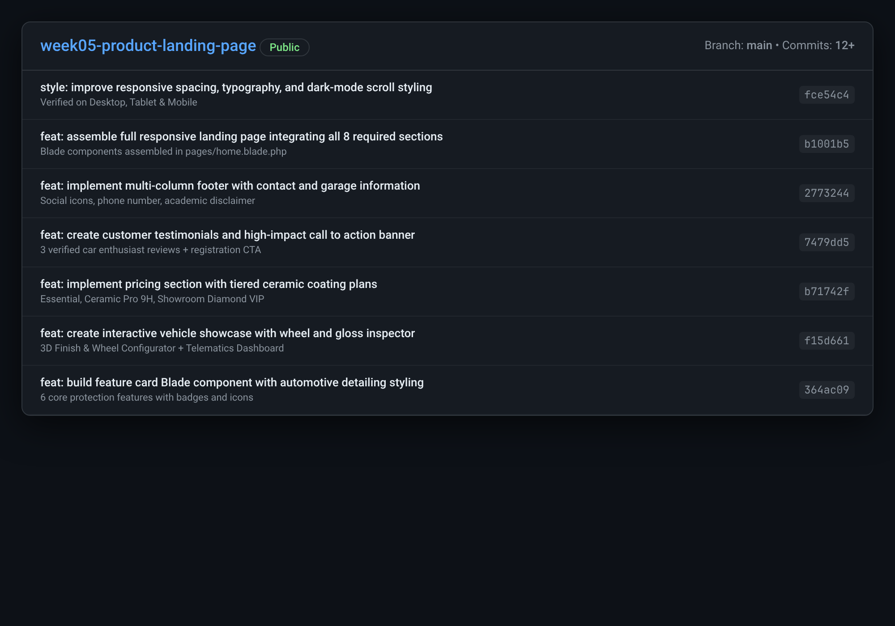

---

## 11. Problems Encountered & Solutions

### 1. Problem: Horizontal Viewport Overflow on Mobile Devices
* **Issue:** Initial testing on a 375px mobile viewport revealed slight horizontal scroll caused by absolute ambient glow blurs and fixed-width vector art.
* **Solution:** Added `overflow-x-hidden` to the top-level container in `layouts/app.blade.php`, wrapped ambient blur discs in `pointer-events-none` containers, and made the vehicle illustration scalable using responsive SVG viewboxes with `w-full h-auto`.

### 2. Problem: Blade Component Class Merging and Polymorphic Button Elements
* **Issue:** When creating `<x-button>`, passing additional classes from parent views was overriding the component's internal default classes, and sometimes an `<a>` link was needed instead of a `<button>`.
* **Solution:** Used Laravel's `$attributes->merge(['class' => ...])` along with an `@if ($href)` conditional check so the component gracefully renders either an anchor or a button tag while preserving variant color classes.

### 3. Problem: Dynamic Interactive State without Heavy External Frameworks
* **Issue:** We wanted an interactive wheel configurator and gloss toggle (allowing tires and finishes to be swapped on click) without introducing heavy external JavaScript libraries that could slow down mobile performance.
* **Solution:** Implemented clean vanilla JavaScript inside the component that dynamically toggles Tailwind utility classes, rotates wheel groups via GPU-accelerated CSS transforms (`transform-gpu`), and updates HUD readouts in real time.

### 4. Problem: 3D Model Bounding-Box Clipping and Text Readability During Scroll
* **Issue:** The elongated sports car model (~4.5m) experienced edge clipping when rotating at angles because the camera radius was zoomed closer than the bounding sphere, resulting in a visible box-shaped cutoff line. Additionally, the traveling 3D vehicle threatened to obscure text content during scroll transitions.
* **Solution:** Configured `<model-viewer>` with `bounds="tight"` and camera orbit radius at `102%`, paired with an adaptive square canvas stage centered on anchor coordinates. Implemented quintic Hermite S-curve docking (`snappyEase`) with 20% resting thresholds and assigned `relative z-20` solid white backgrounds to all card elements so the 3D car (`z-10`) always passes behind cards with zero text obstruction.

---

## 12. Reflection
Building the **Studio5 Auto Detailing & Ceramic Coating** landing page provided practical experience in how modern frontend architecture is implemented within the Laravel ecosystem. Prior to this activity, it was common to build web pages by writing hundreds of lines of static HTML in a single file. Working with Laravel Blade components demonstrated the immense power of **modular UI development**. Breaking down interfaces into reusable components like `<x-feature-card>` and `<x-pricing-card>` drastically reduces code duplication, enforces design consistency, and makes long-term maintenance straightforward.

Another significant takeaway was the workflow advantages of **Tailwind CSS**. Rather than spending hours inventing arbitrary class names and writing custom media queries in separate CSS files, Tailwind's utility-first classes allow responsive design to be crafted directly where the content lives. Learning how to fluidly pair Flexbox for one-dimensional navigation bars with CSS Grid for multi-tier pricing and feature matrices created an intuitive, highly responsive layout that looks equally sharp on smartphones, tablets, and 4K displays.

Lastly, grounding this project in a real community automotive business highlighted the critical relationship between **UI/UX design and business conversion**. Incorporating customer trust markers—such as 9H hardness ratings, 5-year warranty badges, client diagnostic dashboards, and interactive coating comparisons—transforms a simple webpage into an authoritative digital showroom. This project reinforced the essential frontend engineering skills required to build production-grade, component-driven client-server applications.

---

## 13. References
* Laravel LLC. (2026). *Blade Templates & Components Documentation*. https://laravel.com/docs/blade
* Tailwind Labs Inc. (2026). *Tailwind CSS Documentation*. https://tailwindcss.com/docs
* Mozilla Developer Network (MDN). (2026). *CSS Flexible Box Layout & CSS Grid*. https://developer.mozilla.org/en-US/docs/Web/CSS
* W3C Web Accessibility Initiative (WAI). (2026). *Web Content Accessibility Guidelines (WCAG) 2.2*. https://www.w3.org/WAI/standards-guidelines/wcag/
